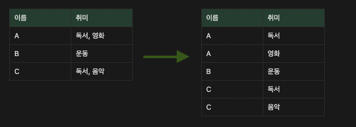
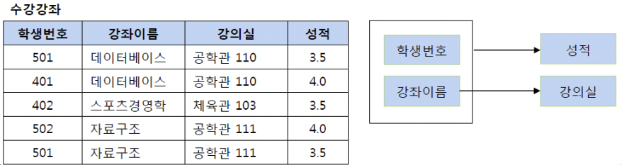
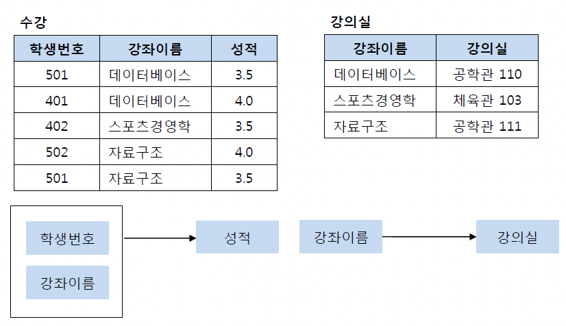
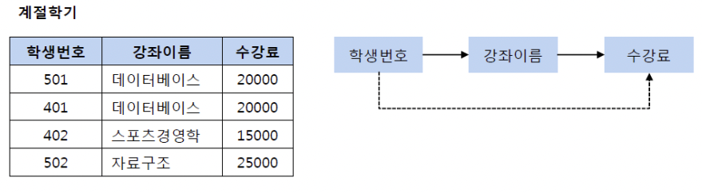
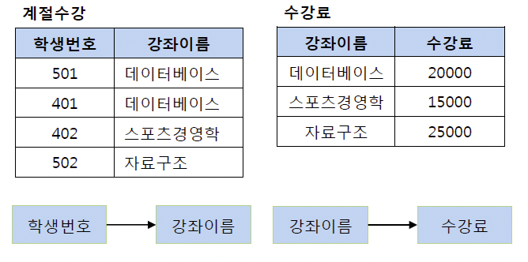
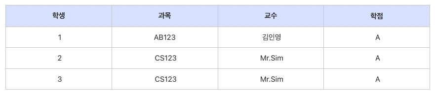
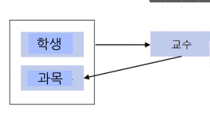
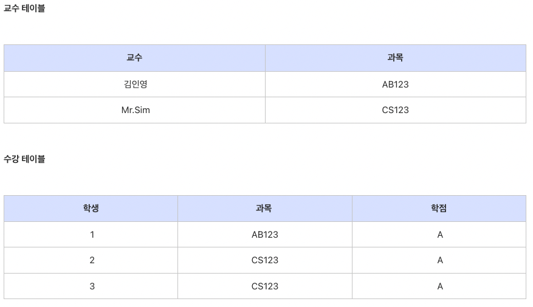

# 데이터베이스 정규화(Normalization)

정규화란 테이터베이스 설계를 구성하는 테크닉이다.

목적
1. 불필요한 데이터를 제거
2. 데이터를 "논리적으로" 저장한다.

정규화의 법칙은 1차, 2차, 3차, BCNF, 4차, 5차 정규화로 나눌 수 있는데 실무에서 4, 5차까지 하는 경우는 많지 않다고 한다.  
정규화 설명에 앞서 알아야하는 개념들이 있다.  
함수 종속성 (완점 함수 종속, 부분 함수 종속, 이행 함수 종속)이 그 것이다.  

## 함수 종속성

## 제 1 정규형
하나의 컬럼은 값이 1개만 있어야함. 이를 컬럼이 **원자값**을 갖는다고 표현  
여러 값을 넣고 싶으면 로우를 더 만들어야함 → 데이터 중복은 증가하지만 논리적 구성을 위해 이 부분을 희생

## 제 2 정규형
모든 컬럼이 완전 함수적 종속을 만족하는 것  
즉, 여러 기본키를 가지는 테이블에서 특정 기본키에만 종속되는 컬럼이 있어서는 안된다

이 테이블에서 기본키는 (학생번호, 강좌이름)으로 복합키이다. 그리고 (학생번호, 강좌이름)인 기본키는 성적을 결정하고 있다. (학생번호, 강좌이름) --> (성적)  
그런데 여기서 강의실이라는 컬럼은 기본키의 부분집합인 강좌이름에 의해 결정될 수 있다. (강좌이름) --> (강의실)

## 제 3 정규형
기본키를 제외한 속성들 간의 **이행적 함수 종속**이 없어야 함  
**(이행적 종속성 이란? X→Y이고 Y→Z이면 X→Z가 성립한다는 내용)**  
즉, 키본키 이외의 다른 컬럼이 그 외 다른 컬럼을 결정할 수 없다. 

2차와 마찬가지로 테이블 분리로 해결

## BCNF (Boyce Codd Normal Form)
3차 정규형의 강화 버전, 3차로 해결할 수 없는 이상현상을 해결 가능  
3차를 만족하면서 **모든 결정자가 후보키 집합에 속한 정규형**  
(후보키란? 기본키가 될 수 있는 컬럼)

여기서 후보키는 (학생, 과목) 하나밖에 없다.  
교수는 과목을 결정하고 있기 때문에 결정자  
그러나 교수는 후보키가 아니기 때문에 BCNF를 만족하지 않음

위와 같이 테이블이 구성된 경우에 데이터가 중복되고, 갱신 이상이 발생  
예를 들어 Mr.Sim이 강의하는 과목명이 바뀌었다면 두 개의 로우를 갱신해야함  
이를 해결하기 위해 테이블을 분리해야함

참고 글   
[데이터베이스 정규화 1NF, 2NF, 3NF, BCNF](https://3months.tistory.com/193)  
[[Database] 정규화(Normalization) 쉽게 이해하기](https://mangkyu.tistory.com/110)  
[함수 종속성(완전 함수 종속, 부분함수 종속, 이행함수 종속)의 개념](https://developer111.tistory.com/80)  
[[SQL] 키(슈퍼키,대체키,후보키,기본키,외래키)](https://jerryjerryjerry.tistory.com/49)